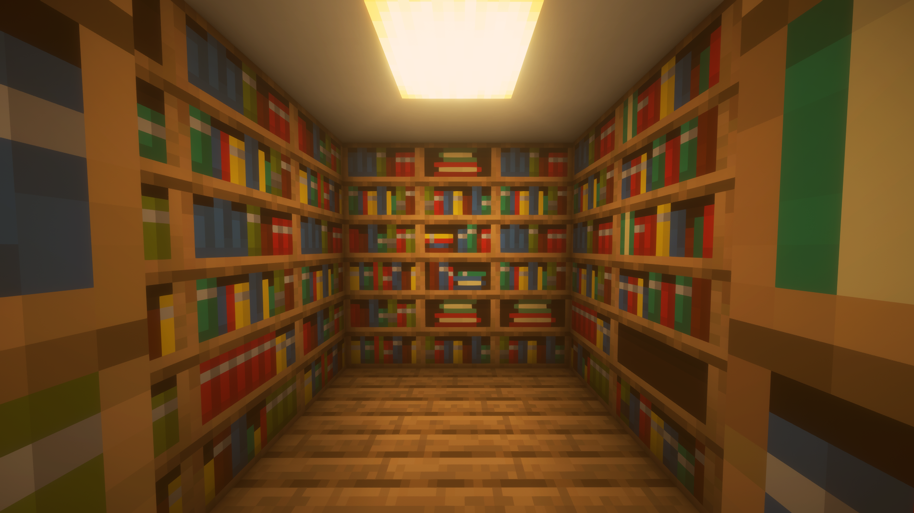

Collecting workspace information# Cartea Vie - Interactive Event Website



## Overview

Cartea Vie ("The Living Book") is an interactive event website for an upcoming event on March 14, 2025, at Alexandru Ioan Cuza Theoretical High School. The site features a Minecraft-inspired design with an interactive 3D enchanting table model and modern, responsive UI.

## Features

- **Interactive 3D Model**: Features a Minecraft enchanting table that rotates based on mouse movement (desktop) or has gentle oscillation animation (mobile)
- **Responsive Design**: Fully responsive layout with custom mobile navigation
- **Animated Typography**: Text animations in the hero section
- **Smooth Scrolling**: Custom implementation for better browser support
- **Image Gallery**: With zoom and navigation capabilities
- **Minecraft Theme**: Custom Minecraft font and styling elements

## Technologies Used

- [Next.js](https://nextjs.org/) - React framework
- [React](https://react.dev/) - UI library
- [Three.js](https://threejs.org/) - 3D graphics library
- [TailwindCSS](https://tailwindcss.com/) - Utility-first CSS framework
- [React Icons](https://react-icons.github.io/react-icons/) - Icon library
- [TypeScript](https://www.typescriptlang.org/) - Type safety

## Installation

```bash
# Clone the repository
git clone https://github.com/yourusername/cartea-vie.pages.dev.git
cd cartea-vie.pages.dev

# Install dependencies
npm install
```

## Development

Run the development server with Turbopack for faster refresh:

```bash
npm run dev
```

Open [http://localhost:3000](http://localhost:3000) to view the site in your browser.

## Building for Production

```bash
npm run build
```

This generates static HTML export in the `out` directory, ready for deployment to any static hosting provider.

## Project Structure

```
├── public/            # Static assets
│   ├── fonts/         # Custom fonts including Minecraft Bold
│   ├── images/        # Image assets
│   └── models/        # 3D models (.glb files)
│
├── src/
│   ├── app/           # Next.js App Router
│   │   ├── globals.css   # Global styles
│   │   ├── layout.tsx   # Root layout component
│   │   └── page.tsx     # Homepage
│   │
│   └── components/    # React components
│       ├── ui/        # UI components like buttons
│       ├── About.tsx
│       ├── EnchantingTable.tsx
│       ├── Footer.tsx
│       ├── Gallery.tsx
│       ├── Header.tsx
│       ├── Hero.tsx
│       └── styles.module.css
```

## Scripts

- `npm run dev` - Start development server
- `npm run build` - Build for production
- `npm run start` - Start production server
- `npm run lint` - Run ESLint

## Deployment

This project is configured for static export and can be deployed to any static hosting service like Vercel, Cloudflare Pages, or GitHub Pages.

## License

This project is licensed under the Creative Commons Attribution-NonCommercial 4.0 International License (CC BY-NC 4.0). This means you are free to:

- Share — copy and redistribute the material in any medium or format
- Adapt — remix, transform, and build upon the material

Under the following terms:

- Attribution — You must give appropriate credit, provide a link to the license, and indicate if changes were made.
- NonCommercial — You may not use the material for commercial purposes or sell this work or derivatives.

[View the full license](https://creativecommons.org/licenses/by-nc/4.0/)

## Credits

- Minecraft font and 3D models used for educational/demonstration purposes
